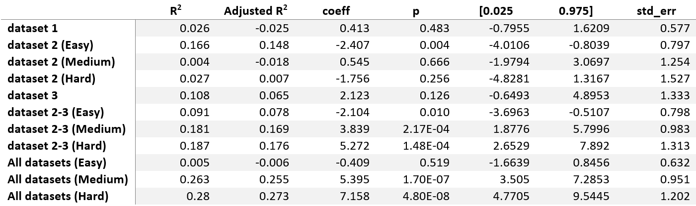

<h1>Exploration of a Potential Relationship between N200 Peak-Latency and Visual Encoding Time</h1>

<h2>Summary</h2>

<b>Reaction time (RT)</b> is a crucial element in the study of more complex processes related to decision-making, which is
being extensively studied by many different disciplines, such as psychology, systems neuroscience or computational
cognitive modelling. Sequential sampling models, which have emerged from the latter, rely on the idea that perceptual
decisions are made possible by a process of evidence accumulation and have been relatively influential on the study of
this topic. However, RT is thought to include other cognitive processes than a sole accumulation of evidence and some
researchers believe that it can be subdivided into component parts, each reflecting the duration of such processes. For
example, recent evidence from <a href="https://pubmed.ncbi.nlm.nih.gov/31028925/">Nunez et al. (2019)</a> suggests a 
positive linear relationship between the peak-latency of the <b>N200</b> event-related potential (ERP) component and <b>visual 
encoding time (VET)</b>. The authors show that duration increases in the former led to equivalent increases in <b>non-decision
time (NDT)</b>, an independent estimate that is thought to include VET and is derived from cognitive models of RT. On the 
other hand, this evidence was only shown in one type of task and the authors reported that the association between the 
N200 and VET might not hold true in all conditions, as demonstrated by a lack of a 1-to-1 ms linear relationship on single-trials.

The aim of the present study was thus to further explore the findings of Nunez et al. (2019) and the hypothesis 
that the peak-latency of the N200 tracks NDT in perceptual decision-making tasks. This was done by applying 
regression analysis on three publicly available EEG datasets that fitted the selection criteria. In order to be selected,
the datasets had to include a twoalternative forced-choice task in the visual modality with a clear stimulus onset time 
and recordings of RT. Additionaly, an "EZ-diffusion model" was fitted with the participants' data (RT and task accuracy) 
and the resulting NDT estimates were used in a final regression analysis. 

<b>Results</b>
- Although not replicating the 1-to-1 ms relationship found in Nunez et al. (2019), the results indicate a significant positive 
relationship between estimates of NDT and the peak-latency of the N200 under certain conditions
- The regressions were especially influenced by 5 outliers and by experimental conditions in dataset 2

<b>Limitations</b>
- A relatively small number of participants in datasets 1 & 3
- Five participants from dataset 1 dropped from final analysis due to missing information
- Some of the choices that were made to increase data quality were envisioned a priori

<b>Keywords</b>: N200, N2, decision-making, visual encoding time, non-decision time, event-related potentials

<h2>Datasets Information</h2>
  
  
<h2>Background</h2>

  
Definitions

  
  Visual Encoding Time (VET) 
  - initial period for visual information processing   
  - thought to reflect early cognitive processes like figure-ground segregation   
  - 150-200 ms post stimulus, depending on visual noise, levels of attention   
 
  Non-Decision Time (NDT)  
  - period within response time (RT) that includes cognitive processes not related to evidence accumulation in decision-making tasks  
  - an independent estimate that is thought to include VET and is derived from cognitive models of RTs   
  
  N200
  - negative Event-Related Potential (ERP) typically occurring 180-325 ms post stimulus presentation <a href="https://pubmed.ncbi.nlm.nih.gov/16239953/">(Patel & Azzam, 2005)</a>  
  - thought to reflect processes associated with perception, selective attention, and cognitive control (<a href="https://pubmed.ncbi.nlm.nih.gov/17850238/">Folstein & Van Petten, 2008</a>; Patel & Azzam, 2005)  

Nunez et al. (2019)
 
1. Response time and choice data from participants fitted to drift-diffusion models (DDM) 
2. Response time data simulated with various amounts of trial-to-trial variability in NDT and evidence accumulation rate 
3. Mean NDT across trials was well estimated by 10th percentiles of response time distributions  

<b>Conclusion</b> 
N200 latencies:
- vary across individuals
- are modulated by external visual noise
- increase by x milliseconds when response time increases by x milliseconds 

<b>Limitations</b> 
hypothesis might not hold true in all conditions: 
- lack of a 1-to-1 ms linear relationship on single-trials
- supporting evidence was only shown in one type of task

<h2>N200 Identification</h2>

  
Preprocessing Steps & N200 Identification

  The EEG activity was processed with <a href="https://mne.tools/stable/index.html">MNE</a>, an open-source python package dedicated to the analysis of
  neurophysiological data. Raw data was obtained for the first and third dataset, while the data used from the second one
  had already been preprocessed.
  
  Preprocessing of the raw EEG data for dataset 1 and 3 was performed in the following order:
  1. Average reference applied to all the electrodes 
  2. Bandpass filter (0.1-100 Hz)
  3. Artifact removal using Independent Component analysis (ICA)  
  ICA was applied to dataset 1 and 3 to remove eye movement artifacts. EOG electrodes from the third dataset
  were used to this end, but had to be simulated from EEG data in the first dataset. This was done through the
  MNE package, by creating a bipolar reference from two frontal EEG electrodes and using it as a proxy for an EOG
  electrode. Electrode “1EX4” was used as the anode and “1EX5” as the cathode.
  4. Bandpass filter (1-10 Hz)
  5. Epoching  
  Epochs were time-locked on stimulus presentation, starting 200 ms before stimulus-onset and with a total
  duration of 500 ms.
  6. Baseline correction  
  Baseline correction was applied to each epoch using the 200 ms period before stimulus-onset.
  7. Linear detrend
  8. Epochs and electrodes rejection  
  Any epoch containing more than 30% of its electrodes showing absolute amplitudes greater than 100 μV were
  automatically rejected. Any electrode showing absolute amplitudes greater than 100 μV in more than 20 epochs
  were automatically rejected from every epoch.
  9. Generating the ERP  
  Stimulus-locked ERP were generated by averaging the EEG activity across the selected epochs.
  10. Singular value decomposition (SVD)  
  SVD was applied to the data using Python’s Numpy library. The resulting U (Timepoints x Components) and V
  (Components x Electrodes) matrices, were respectively used to identify the waveform and spatial distribution of
  the N200 in the ERP of each participant.
  11. Template matching  
  The waveform template was reframed and resampled to match the specified N200’s time window – here, 125 to
  275ms post-stimulus – and the sampling rate used in each dataset. The topographic template was converted
  into a grayscale image (1280 x 1280 pixels) and vectorized. Both the waveform and topographic templates were
  derived from Nunez et al., (2019). Similarly to the topographic template, topographic maps (1280 x 1280 pixels)
  of the components from the V matrix were converted into a vector of grayscale values.
  For each participant, the first 10 components of the U and V matrices were correlated (Pearson's r) with the
  waveform and topographic templates, respectively. The product of the two correlation coefficients was then 
  calculated for each component, and the component with the highest product was designated as reflective of a
  participant’s N200.
  12. Estimation of NDT 
  For each participant, the 10th percentile of RT was used as an estimate of NDT, as suggested by Nunez et al. (2019).
  13. Linear regression analysis 
  A linear regression analysis wasperformed using the open-source python module statsmodels. The analysis was first 
  conducted on each dataset independently and then on a merged version of the three datasets

<h2>Tasks Description</h2>

  
Dataset 1

  Participants performed a version of a two-back continuous performance task that included rewards and
  punishments, themselves communicated via auditory feedback tones. The participants were presented with a
  succession of letters on a screen and had to determine with button presses whether any given letter was the same as
  the one presented two occurrences earlier.

  
Dataset 2

  Participants were presented with Gabor patches that were embedded in visual noise and varied in
  orientations and spatial frequencies. The experiment consisted of two tasks, each containing three different block types
  of increasing difficulty.
  In the first one, the so-called “Signal task”, the goal was to classify Gabor patches into two categories of either low or
  high spatial frequencies. The patches were presented with an orientation of either 45 or 135 degrees and the difficulty
  was increased between the three block types by lowering the discrepancy in spatial frequency between the two
  categories:

  - Easy: low frequency patches were shown at 2.35 cycles per degree (cpd), and high frequency patches at 2.65 cpd
  (0.3 cpd difference).
  - Medium: low frequency patches were shown at 2.4 cpd and high frequency patches at 2.6 cpd (0.2 cpd
  difference).
  - Hard: low spatial frequency patches were shown at 2.45 cpd and high spatial frequency patches at 2.55 cpd (0.1
  cpd difference).  

  The goal of the second task (Signal-Response (SR) Mapping) depended on the difficulty of the block. Gabor patches were
  once again presented with an orientation of either 45 or 135 degrees, but this time the spatial frequency was kept
  constant for the two categories across block types, with low and high frequency patches shown at 2.4 cpd and 2.6 cpd,
  respectively. The goal of the task varied as follows:
  - Easy: participants were asked to respond by pressing a single button whenever they detected any Gabor patch.
  - Medium: participants had to discriminate low and high frequency patches by pressing one of two buttons.
  - Hard: participants had to discriminate the patches based on both spatial frequency and orientation by pressing
  one of two buttons. As an example, one button corresponded to patches with both high spatial frequency and a
  45-degree orientation, while the other corresponded to patches with both low spatial frequency and an
  orientation of 135 degrees.  
  
  <b>Due to time constraints, only the data from the first task was used in the present study.</b>
  

  
Dataset 3

  Participants performed a random dot motion task where the goal, in each trial, was to determine
  whether an array of moving dots is shifting to the left or to the right of the screen. The array contains two types of dots,
  together forming a borderless circle. In one type, each dot is independently moving in pseudo-random directions while,
  in the other, the dots are collectively moving either toward the left or the right. The task included two different
  conditions: accuracy trials, in which the participants were asked to respond as accurately as they could, and speed trials,
  in which they were asked to respond as quickly as they could. The array of dots was shown for 1.5 second on each trial
  and visual feedback was given after every response.  

<h2>Supplementary Data</h2>
  

  
Dataset 1

    

  
Dataset 2

  
  
  

  
Dataset 3

  

  
All Datasets combined

  
  
  

<h2>Scripts Description</h2>
- N200_extraction.py: module containing customized functions to identify the N200 component in preprocessed ERP files (using <a href="https://mne.tools/stable/generated/mne.Evoked.html#mne-evoked">MNE's "evoked" format</a>)  
- Proj1-Analysis.py: script used to preprocess and analyze the data from dataset 1 (demonstrates how the functions contained in N200_exctration.py are being used) 
